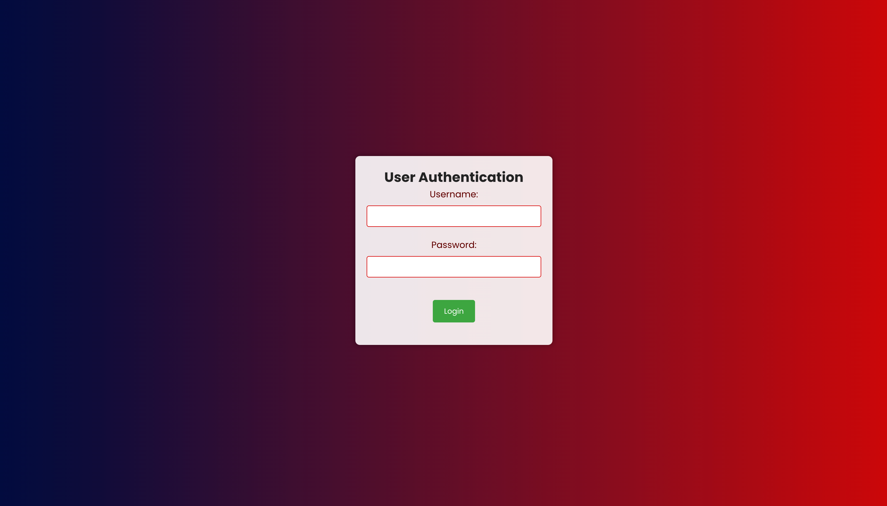
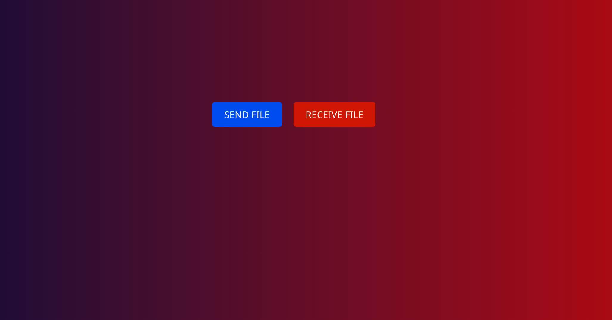
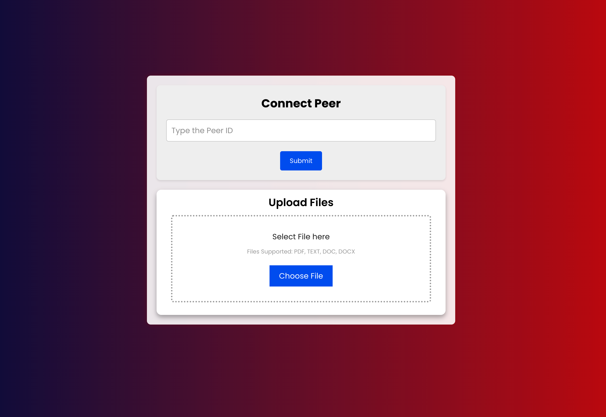
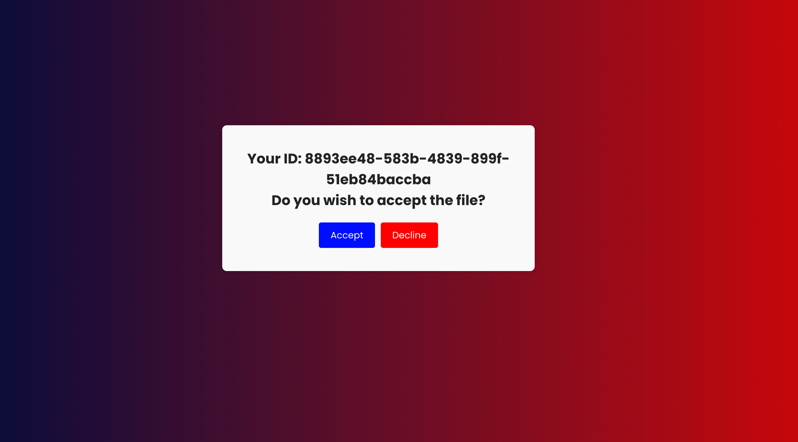
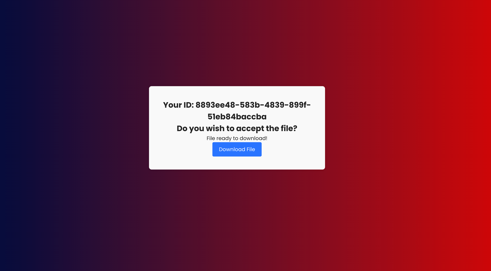

# File Transfer Web App

This web application enables users to securely send, receive, and download files through peer-to-peer connections. It features user authentication for a personalized experience and uses MongoDB for storing user data. The backend is built with Node.js for server routing, and the frontend is developed using React.

## Features

- **User Authentication:** Secure user authentication ensures a personalized and safe environment for file transfers.

- **File Sending and Receiving:** Users can easily send files to others and receive files through peer-to-peer connections.

- **Download Functionality:** Download the received files directly from the web app.

## Technologies Used

- Node.js
- React
- MongoDB
- PeerJS (WebRTC)

## Screenshots








## Setup

1. **Clone the Repository:**
   ```bash
   git clone https://github.com/Deep03/Peer-Circle.git
   ```

2. **Install Dependencies:**
   ```bash
   cd file-transfer-web-app
   npm install
   ```

## Usage

1. **Start the Server:**
   ```bash
   npm start
   ```

2. **Access the Web App:**
   Open your web browser and navigate to `http://localhost:3000`.

3. **User Authentication:**
   - Create a new account or log in if you already have an account.

4. **File Transfer:**
   - Use the interface to send and receive files securely.

5. **Download Files:**
   - Once a file is received, you can download it directly from the web app.

## Contributing

Feel free to contribute to the development of this project!

## License

This project is licensed under the [MIT License](LICENSE).
```
